# 🛡️ 3-LAYER PROTECTION STRATEGY GUIDE
## Complete Intellectual Property Protection Framework

---

### 📋 **STRATEGY OVERVIEW**

**Creator:** BENNY HARIANTO  
**Email:** creatoropensource@gmail.com  
**LinkedIn:** www.linkedin.com/in/bennyharianto-024868383  
**Technology:** UltraCrypto Multi-Dimensional Encryption Framework  
**Implementation Date:** September 10, 2025  

---

## 🎯 **3-LAYER PROTECTION ARCHITECTURE**

```mermaid
graph TD
    A[Public GitHub Viewer] --> B[🔓 Layer 1: MIT License]
    B --> C[Basic Code Viewing & Evaluation]
    
    D[Serious Prospect] --> E[🤝 Layer 3: NDA Execution]
    E --> F[Technical Demo & Deep Dive]
    F --> G[🔒 Layer 2: Commercial License]
    G --> H[Full Access & Revenue Generation]
    
    I[Casual Viewer] --> B
    J[Competitor] --> B
    K[Academic Researcher] --> B
    
    L[Enterprise Client] --> E
    M[Government Agency] --> E
    N[Technology Partner] --> E
```



---

## 🔓 **LAYER 1: MIT LICENSE (Public Protection)**

### **📋 PURPOSE**
- **Public Repository Protection** for GitHub visibility
- **Basic Legal Protection** against unauthorized claims
- **Educational and Research Access** for legitimate users
- **Marketing and Visibility** for business development

### **📄 FILE: LICENSE**
- **Location:** `/doc-legal/github-strategy/LICENSE`
- **Audience:** All GitHub visitors and public users
- **Protection Level:** 🟡 Medium (Civil Court Enforcement)

### **✅ WHAT IT ALLOWS**
- **Viewing and Evaluation** of public repository content
- **Educational Use** for learning and research purposes
- **Basic Attribution** requirements for any use
- **Non-Commercial Experimentation** with demo code

### **❌ WHAT IT PROHIBITS**
- **Commercial Use** without separate commercial license
- **Redistribution** of proprietary algorithms or trade secrets
- **Patent Circumvention** or reverse engineering attempts
- **Competitive Development** based on disclosed concepts

### **🎯 BUSINESS IMPACT**
- **Legitimacy Signal** - Shows serious, professional technology
- **Trust Building** - Demonstrates transparency and confidence
- **Lead Generation** - Attracts potential customers and partners
- **SEO Benefits** - Improves search visibility and credibility

---

## 💰 **LAYER 2: COMMERCIAL LICENSE (Revenue Protection)**

### **📋 PURPOSE**
- **Revenue Generation** through commercial licensing
- **Commercial Use Authorization** for paying customers
- **Advanced Support and Services** for enterprise clients
- **Intellectual Property Monetization** and protection

### **📄 FILE: COMMERCIAL_LICENSE.md**
- **Location:** `/doc-legal/github-strategy/COMMERCIAL_LICENSE.md`
- **Audience:** Paying commercial customers only
- **Protection Level:** 🟢 High (Civil Court + Contract Enforcement)

### **💼 LICENSING TIERS**

#### **🥉 Tier 1: Startup License**
- **Price:** Rp 25,000,000/year (≈ $1,700 USD)
- **Target:** Companies with <$10M revenue
- **Features:** Basic support, internal use up to 100 employees

#### **🥈 Tier 2: Enterprise License**
- **Price:** Rp 75,000,000/year (≈ $5,000 USD)
- **Target:** Companies with $10M-$100M revenue
- **Features:** Priority support, internal use up to 1,000 employees

#### **🥇 Tier 3: Corporate License**
- **Price:** Rp 150,000,000/year (≈ $10,000 USD)
- **Target:** Companies with >$100M revenue
- **Features:** Premium support, unlimited use, white-label rights

#### **🏛️ Tier 4: Government License**
- **Price:** Negotiable (typically Rp 200,000,000+)
- **Target:** Government agencies and defense contractors
- **Features:** Classified deployment, security clearance support

### **🎯 BUSINESS IMPACT**
- **Direct Revenue** from licensing fees
- **Recurring Income** through annual renewals
- **Premium Support Revenue** from professional services
- **Market Validation** through paying customers

---

## 🤝 **LAYER 3: NDA PROTECTION (Negotiation Security)**

### **📋 PURPOSE**
- **Trade Secret Protection** during evaluation and negotiation
- **Confidential Information Security** before commercial agreement
- **Serious Prospect Filtering** to identify qualified buyers
- **Legal Recourse** against information misuse

### **📄 FILE: NDA_TEMPLATE.md**
- **Location:** `/doc-legal/github-strategy/NDA_TEMPLATE.md`
- **Audience:** Serious prospects before technical demos
- **Protection Level:** 🔴 Very High (Civil + Criminal Enforcement)

### **🔐 PROTECTED INFORMATION**
- **Technical Specifications** and implementation details
- **Algorithm Parameters** and optimization techniques
- **Performance Metrics** and benchmarking data
- **Commercial Terms** and pricing strategies
- **Business Plans** and market analysis

### **⏰ EVALUATION PROCESS**

#### **Phase 1: Initial Disclosure (Week 1-2)**
- High-level architecture presentation
- Performance metrics and competitive comparison
- Use case analysis for specific needs
- Commercial framework recommendation

#### **Phase 2: Technical Deep-Dive (Week 3-4)**
- Detailed technical specifications
- Security analysis and compliance validation
- Integration planning and architecture review
- Performance testing in controlled environment

#### **Phase 3: Proof of Concept (Week 5-8)**
- Limited implementation for specific use case
- Performance benchmarking in client environment
- Security validation and compliance testing
- Business case development and ROI analysis

#### **Phase 4: Commercial Negotiation (Week 9-12)**
- Licensing terms negotiation and customization
- Contract development and legal review
- Implementation planning and timeline development
- Final agreement execution and onboarding

### **🎯 BUSINESS IMPACT**
- **Trade Secret Protection** during vulnerable negotiation period
- **Competitive Intelligence Security** against industrial espionage
- **Serious Buyer Identification** through commitment demonstration
- **Legal Leverage** in case of information misuse

---

## 🔄 **LAYER INTERACTION WORKFLOW**

### **🎯 CUSTOMER JOURNEY**

```
1. 🔍 DISCOVERY PHASE
   ├── Public GitHub Repository (Layer 1: MIT License)
   ├── Marketing Materials and Documentation
   ├── Social Media and Professional Networks
   └── Industry Events and Conferences

2. 🤔 EVALUATION PHASE
   ├── Initial Interest and Contact
   ├── NDA Execution (Layer 3: NDA Protection)
   ├── Technical Demonstration and Deep Dive
   └── Proof of Concept and Testing

3. 💼 COMMERCIAL PHASE
   ├── Commercial License Negotiation (Layer 2)
   ├── Contract Execution and Payment
   ├── Implementation and Integration
   └── Ongoing Support and Maintenance
```

### **🛡️ PROTECTION ESCALATION**

```
Public Interest → MIT License (Basic Protection)
     ↓
Serious Inquiry → NDA Required (Enhanced Protection)
     ↓
Commercial Use → Commercial License (Full Protection)
```

---

## 📊 **EFFECTIVENESS ANALYSIS**

### **🎯 PSYCHOLOGICAL IMPACT**

#### **Layer 1 Effect:**
- **"This is legitimate technology"** - Professional presentation
- **"I can evaluate safely"** - MIT license provides comfort
- **"This has real value"** - Patent pending status creates urgency

#### **Layer 3 Effect:**
- **"This is serious technology"** - NDA requirement signals value
- **"I need to commit to learn more"** - Filters out casual browsers
- **"This contains valuable secrets"** - Creates anticipation and interest

#### **Layer 2 Effect:**
- **"This has proven commercial value"** - Paying customers validate worth
- **"I get real support and service"** - Professional relationship established
- **"This is a strategic investment"** - Long-term partnership mindset

### **🛡️ LEGAL EFFECTIVENESS**

| Layer | Protection Level | Enforcement | Deterrent Effect | Revenue Impact |
|-------|------------------|-------------|------------------|----------------|
| **Layer 1: MIT** | 🟡 Medium | Civil Court | Moderate | Indirect |
| **Layer 2: Commercial** | 🟢 High | Civil + Contract | High | Direct |
| **Layer 3: NDA** | 🔴 Very High | Civil + Criminal | Very High | Indirect |

### **💰 BUSINESS METRICS**

#### **Revenue Streams:**
- **Direct Licensing:** Rp 25M - 200M+ per customer annually
- **Professional Services:** Implementation and consulting fees
- **Support Contracts:** Ongoing maintenance and support revenue
- **Partnership Revenue:** Technology transfer and joint ventures

#### **Cost Savings:**
- **Legal Protection:** Reduced IP theft and litigation costs
- **Sales Efficiency:** Qualified leads through NDA filtering
- **Support Optimization:** Tiered support reduces overhead
- **Market Positioning:** Premium pricing through protection strategy

---

## 📋 **IMPLEMENTATION CHECKLIST**

### **✅ LAYER 1: MIT LICENSE**
- [x] **LICENSE file created** and merge conflicts resolved
- [x] **Copyright holder** correctly set to BENNY HARIANTO
- [x] **Patent protection notice** included and comprehensive
- [x] **3-layer strategy explanation** added to license
- [x] **Contact information** consistent across all files
- [x] **GitHub repository** updated with clean license

### **✅ LAYER 2: COMMERCIAL LICENSE**
- [x] **COMMERCIAL_LICENSE.md** created with comprehensive terms
- [x] **Pricing tiers** defined for different market segments
- [x] **Terms and conditions** clearly specified
- [x] **Support levels** defined for each tier
- [x] **Payment terms** and processes documented
- [x] **Contact process** for licensing inquiries established

### **✅ LAYER 3: NDA TEMPLATE**
- [x] **NDA_TEMPLATE.md** created with legal framework
- [x] **Confidential information** scope clearly defined
- [x] **Evaluation process** structured and documented
- [x] **Legal remedies** and enforcement mechanisms specified
- [x] **Execution process** streamlined for prospects
- [x] **Template customization** ready for specific companies

### **📋 NEXT STEPS**

#### **Immediate Actions (This Week):**
- [ ] **Commit and push** all new files to GitHub repository
- [ ] **Update README.md** to reference 3-layer protection strategy
- [ ] **Test repository access** and verify all files are visible
- [ ] **Prepare email templates** referencing the protection layers

#### **Short-term Actions (Next Month):**
- [ ] **Client outreach** using new protection framework
- [ ] **NDA execution** with first serious prospects
- [ ] **Commercial license** negotiation with qualified leads
- [ ] **Legal review** of all protection documents

#### **Long-term Actions (Next Quarter):**
- [ ] **Revenue tracking** from commercial licenses
- [ ] **Protection effectiveness** analysis and optimization
- [ ] **Legal precedent** establishment through enforcement
- [ ] **Strategy refinement** based on market feedback

---

## 📞 **SUPPORT AND GUIDANCE**

### **🤝 IMPLEMENTATION SUPPORT**

**BENNY HARIANTO**  
*Creator of 3-Layer Protection Strategy*  
*UltraCrypto Multi-Dimensional Encryption Framework*

📧 **Email:** creatoropensource@gmail.com  
🔗 **LinkedIn:** [www.linkedin.com/in/bennyharianto-024868383](https://www.linkedin.com/in/bennyharianto-024868383)  
🌐 **GitHub:** [@CreatorOss](https://github.com/CreatorOss)  

### **📋 AVAILABLE ASSISTANCE**

#### **Legal Support:**
- **Document Review** and customization for specific jurisdictions
- **Contract Negotiation** guidance and best practices
- **Enforcement Strategy** development and implementation
- **Compliance Guidance** for international markets

#### **Business Support:**
- **Pricing Strategy** optimization for different markets
- **Sales Process** development and prospect qualification
- **Revenue Modeling** and financial projections
- **Market Positioning** and competitive differentiation

#### **Technical Support:**
- **Repository Management** and GitHub optimization
- **Documentation Updates** and content refinement
- **Integration Guidance** with existing business processes
- **Performance Monitoring** and effectiveness tracking

---

## 📜 **LEGAL DISCLAIMER**

This 3-Layer Protection Strategy Guide is provided for informational purposes and represents the intellectual property protection framework developed by BENNY HARIANTO for the UltraCrypto Multi-Dimensional Encryption Framework.

**Legal Notice:** This guide does not constitute legal advice. Consult qualified legal counsel for specific legal questions and jurisdiction-specific requirements.

**Copyright:** © 2025 BENNY HARIANTO. All rights reserved.  
**Patent Status:** Technology subject to pending patent applications  
**Licensing:** This protection strategy is available for licensing to other technology creators  

---

**Document Version:** 1.0  
**Creation Date:** September 10, 2025  
**Last Updated:** September 10, 2025  
**Next Review:** December 10, 2025  

---

### 🎯 **SUCCESS METRICS**

Track the effectiveness of your 3-layer protection strategy:

- **Layer 1 Metrics:** GitHub stars, forks, repository views
- **Layer 2 Metrics:** Commercial license inquiries and conversions
- **Layer 3 Metrics:** NDA executions and evaluation completions
- **Overall Metrics:** Revenue generation and IP protection incidents

**Target Goals:**
- **Month 1:** 5 NDA executions, 2 commercial license discussions
- **Month 3:** 2 commercial licenses signed, Rp 100M+ revenue
- **Month 6:** 5+ commercial licenses, established market presence
- **Year 1:** Rp 500M+ revenue, proven protection framework

---

*🛡️ "Protecting innovation through strategic layered defense - maximizing value while minimizing risk." 🛡️*